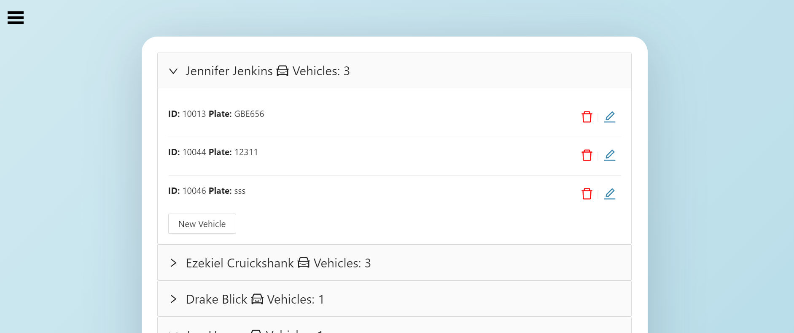

# Shippify Take Home Challenge

> This is a CRUD App Built with React Js, Node + Express, My SQL

## Built With

- React js
- Node js + Express js
- MySQL
- Git & Github

## Getting Started

To get a local copy up and running follow these simple example steps.

### Prerequisites

- Git in your local machine
- Code editor (VS code, Atom, etc)
- Terminal

### Setup

- git clone https://github.com/RafaelEchart/Shippify_FullStack_Task.git
- cd Shippify_FullStack_Task

# This is a 2 app project, frontend and backend, follow the setup carefully.

- Inside the Shippify_FullStack_Task directory we will begin our installation

## FrontEnd Setup

- Enter the frontend directory 

`cd frontend`

- Run in the terminal to install the dependencies:

`npm install`

- Run the app:

`npm run start`

## BackEnd Setup

- Enter the backend directory 

`cd backend`

- Run in the terminal to install the dependencies:

`npm install`

- Run the app:

`npm run start`

## Authors

👤 **Author**

- GitHub: [@rafaelechart](https://github.com/rafaelechart)
- Twitter: [@rafaechart](https://twitter.com/rafaelechart)

## 🤝 Contributing

Contributions, issues, and feature requests are welcome!

## Show your support

Give a ⭐️ if you like this project!

